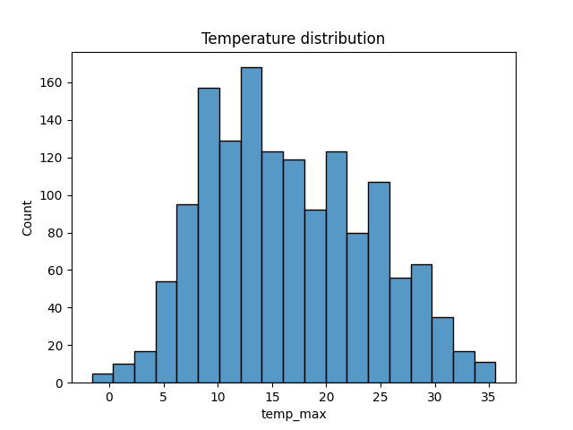
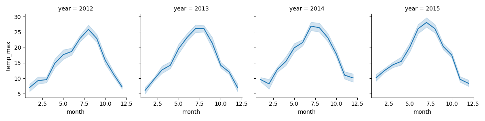

1. dataset info:

[1461 rows x 6 columns]

<class 'pandas.core.frame.DataFrame'>

RangeIndex: 1461 entries, 0 to 1460

Data columns (total 6 columns):

    Column        Non-Null Count  Dtype  
---  ------         --------------  -----  
    date           1461 non-null   object
---
    precipitation  1461 non-null   float64
--- 
    temp_max       1461 non-null   float64
--- 
    temp_min       1461 non-null   float64
--- 
    wind           1461 non-null   float64
--- 
    weather        1461 non-null   object 
---

dtypes: float64(4), object(2)

memory usage: 68.6+ KB

   
Null values:

--- 
      Column        Null count  
---        
    date           0
---
    precipitation  0
--- 
    temp_max       0
--- 
    temp_min       0
--- 
    wind           0
--- 
    weather        0
---

dtype: int64

Duplicate values: 0

Min temp = -7.1
Max temp = 35.6

Most common weather: 
   precipitation  temp_max  temp_min  wind weather
0            0.0      11.1       6.1   2.6    rain

2. Max temp plot

3. FaceGrid max_temp
