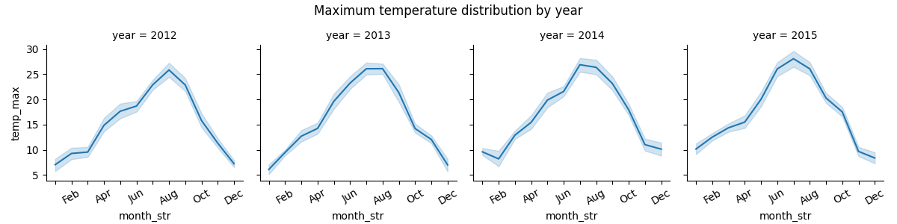
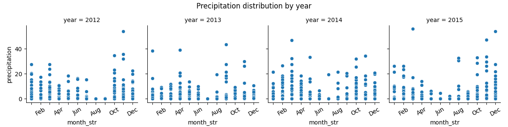
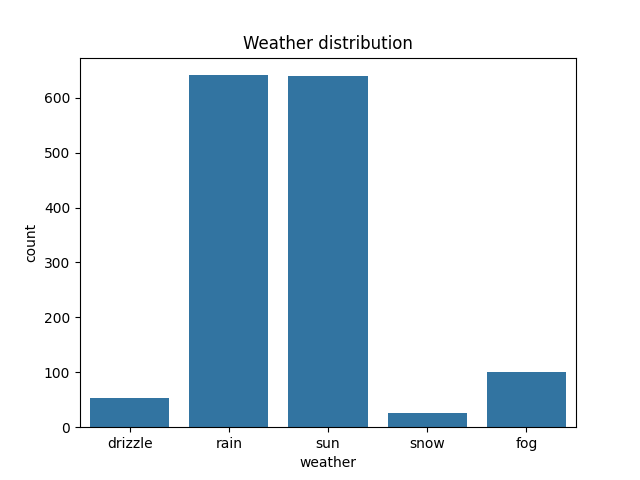
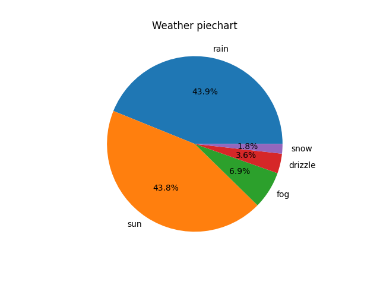
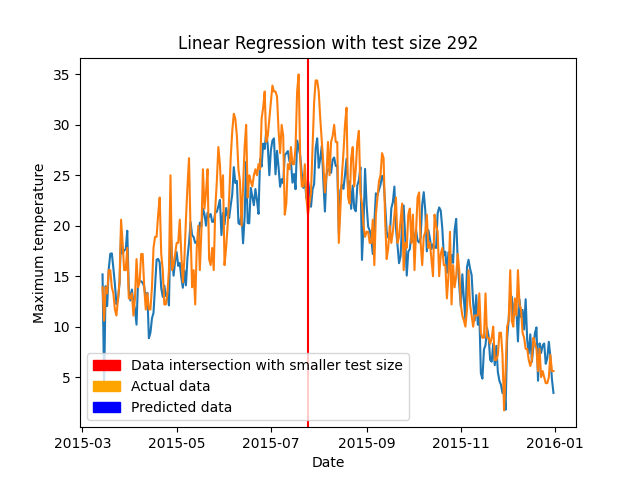
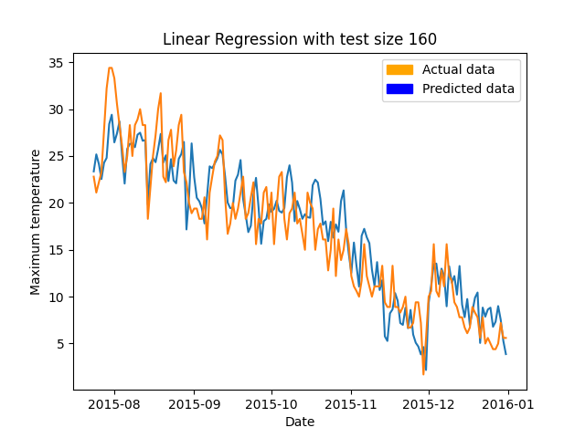
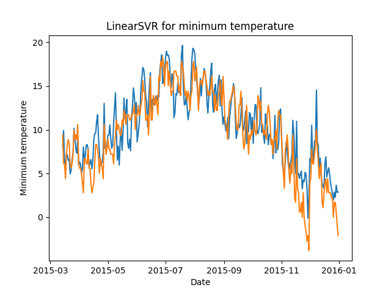

## 1. dataset info:

RangeIndex: 1461 entries, 0 to 1460

Data columns (total 6 columns):

    Column        Non-Null Count  Dtype  
---  ------         --------------  -----  
    date           1461 non-null   object

    precipitation  1461 non-null   float64

    temp_max       1461 non-null   float64

    temp_min       1461 non-null   float64

    wind           1461 non-null   float64

    weather        1461 non-null   object 
---

dtypes: float64(4), object(2)

memory usage: 68.6+ KB 

   
Null values:

--- 
      Column        Null count 
---
      
    date           0

    precipitation  0

    temp_max       0

    temp_min       0

    wind           0

    weather        0
---

No null values as entries have a not-null property

Duplicate values: 0

Min temp = -7.1

Max temp = 35.6

Most common weather:

      precipitation  temp_max  temp_min  wind weather

         0.0      11.1       6.1   2.6    rain

## 2. Max temp plot

Maximum temperatures indicate a moderate climate

## 3. FaceGrid max_temp

An increase in maximum temperature can be observed from year to year.

## 4. Facegrid precipiation

## 5. Weather countplot

## 6. Weather piechart

# Predictions!!

## 1. Linear Regression with 80/20 split

blue line - prediction

orange line - actual maximum temperature

Coeff:

    precipitation -0.170536
---
    month         -0.046500
---
    year          -0.112052
---
    wind          -0.269172
---
    temp_min       1.243752
---

MSE: 11.297832171916616

## 2. Linear Regression with 1300 train units and 160 test

blue line - prediction

orange line - actual maximum temperature

Coeff:

    precipitation -0.173899
---
    month         -0.043918
---
    year           0.133504
---
    wind          -0.272315
---
    temp_min       1.259584
---

MSE: 9.570734696689296

## 3. SVR with 80/20 split for temp_min

blue line - prediction

orange line - actual maximum temperature

Score:  0.7728697614595816

MSE: 5.050154035476825